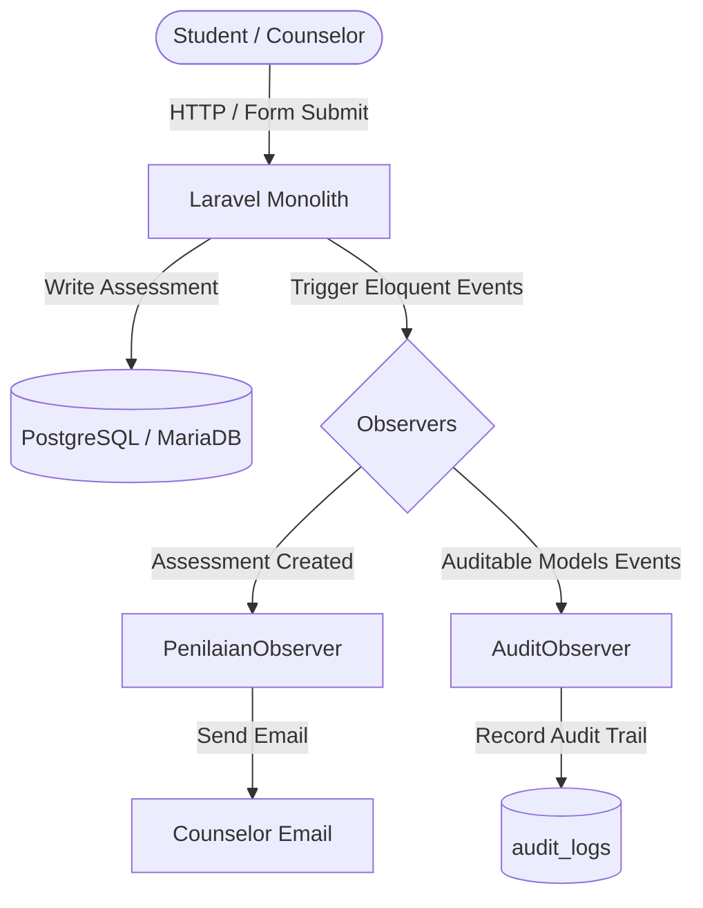

# SPK SMART Laravel — Decision Support System for Student Major Recommendation

<div align="center">

[](https://www.php.net/)
[](https://laravel.com/)
[](https://getbootstrap.com/)
[](https://vitejs.dev/)
[](https://www.postgresql.org/)
[](https://www.docker.com/)
[](https://render.com/)

</div>

**SPK SMART Laravel** is a web-based Decision Support System (DSS) that helps vocational high school counselors (Guru BK) recommend suitable university majors to students. The recommendation is computed objectively using the **SMART (Simple Multi-Attribute Rating Technique)** method, weighing student interests, aptitudes, academic scores, and financial readiness.

This project represents a complete modernization from a legacy PHP Native codebase into a clean **Laravel 13 MVC monolith**, backed by a service-layered calculation engine, event-driven observers, audit logging, role-based access control, and automated testing.

---

## ✨ Key Features

### 1. Isolated SMART Calculation Engine
- All SMART logic lives in `SmartCalculationService`, decoupled from controllers.
- Full pipeline:
  1. **Weight normalization** — `weight / total weight`
  2. **Utility calculation** — supports both **Benefit** and **Cost** criteria
  3. **Multi-attribute ranking** — final score as a normalized 0–1 (0%–100%) match
- Edge-case safe: handles empty data and zero-division scenarios.

### 2. Interactive Student Questionnaire Wizard
- Step-by-step questionnaire grouped by criteria.
- **Partial Save & Resume** — answers are persisted on every step change, so students can continue later without losing progress.
- Clear progress indicator (`12 of 20 questions completed`).

### 3. Action-Oriented Counselor Dashboard
Groups students into real operational statuses instead of plain statistics:
- **Not Started** — needs reminders
- **In Progress** — partial questionnaire
- **Completed** — ready for review and counseling

### 4. Audit Logging & RBAC
- `AuditObserver` automatically records **Create, Update, Delete** operations on five master-data models.
- Tracks actor, IP address, timestamp, and `old_values` vs `new_values`.
- **Sensitive-data sanitization** — password and remember_token fields are excluded from logs.
- Strict `can:access-master-data` gate ensures only counselors can manage master data.

### 5. Anti-Spam Email Notifications
- `PenilaianObserver` sends instant email notifications to counselors when a student completes the questionnaire.
- Duplicate-submission guard prevents email spam if the save button is pressed repeatedly.

### 6. Counseling Notes & PDF Export
- Counselors can add per-student counseling notes directly on the recommendation page.
- **Dual-layer UI**: students see a narrative hero card with match percentage, while counselors see the full SMART tabulation.
- Official PDF export (`dompdf`) includes student identity, ranking table, top recommendation reasoning, and counseling notes.

---

## 🛠️ Tech Stack

| Layer | Technology |
|-------|------------|
| Backend Framework | Laravel 13 (PHP 8.5) |
| Frontend Build | Vite 8 + Tailwind CSS 4 + Bootstrap 5 Modernize |
| Template Engine | Laravel Blade |
| Local Database | MariaDB / MySQL |
| Production Database | PostgreSQL |
| PDF Export | barryvdh/laravel-dompdf |
| Spreadsheet Export | openspout/openspout |
| Testing | PHPUnit 13 |
| Containerization | Docker + Apache (multi-stage build) |
| Deployment | Render.com (Docker Web Service) |

---

## 🏗️ Architecture

The application uses a modern monolithic architecture with clear separation of concerns. Business logic is extracted into a service layer, while Eloquent Observers handle cross-cutting concerns like audit trails and notifications.



### Project Structure
```text
spk-smart-laravel/
├── app/
│   ├── Http/
│   │   ├── Controllers/        # Request handlers
│   │   └── Requests/           # Form request validation
│   ├── Models/                 # Eloquent models
│   ├── Observers/              # AuditObserver, PenilaianObserver
│   ├── Services/
│   │   └── SmartCalculationService.php   # Core SMART engine
│   └── Mail/                   # Mailable classes
├── config/
│   └── database.php            # pgsql & mariadb config
├── database/
│   └── migrations/             # Relational schema
├── resources/
│   ├── views/                  # Blade templates
│   └── js/ & css/              # Vite assets
├── tests/
│   ├── Unit/                   # SMART logic, utility, normalization
│   └── Feature/                # RBAC, PDF export, controller states
├── render.yaml                 # Render PaaS specification
├── Dockerfile                  # Multi-stage production build
└── README.md
```

---

## 🚀 Getting Started

### Prerequisites
- PHP 8.2+
- Composer
- Node.js 20+
- MariaDB / MySQL (local) or PostgreSQL (production)

### 1. Clone & install dependencies
```bash
git clone https://github.com/Rauf74/spk-smart-laravel.git
cd spk-smart-laravel
composer install
npm install
```

### 2. Configure environment
```bash
cp .env.example .env
php artisan key:generate
```
Edit `.env` and set your local database credentials (default connection: `mysql` / `mariadb`).

### 3. Run migrations & seeders
```bash
php artisan migrate --seed
```

### 4. Build frontend & run server
```bash
npm run build
php artisan serve
```
Visit `http://localhost:8000`.

**Default counselor account:** `gurubk` / `password` (siswa: `siswa01` / `password`)

### 5. Development mode (recommended)
```bash
composer run dev
```
This concurrently runs the Laravel server, queue listener, and Vite dev server.

---

## 🧪 Testing

The project includes unit and feature tests to verify the correctness of the SMART algorithm and access-control rules.

```bash
./vendor/bin/phpunit
```

Or use the Composer script:
```bash
composer test
```

### Test coverage
- **Unit**: weight normalization, benefit/cost utility formulas, zero-division guards.
- **Feature**: controller state flows, RBAC access to master data, cross-student PDF export restrictions.

---

## 🌍 Deployment (Render)

The project is configured for zero-friction deployment to Render using Docker.

1. Create a **PostgreSQL** database (Supabase, Aiven, or Render).
2. In Render, create a new **Web Service** and connect this repository.
3. Select **Docker** runtime — Render will read `Dockerfile` and `render.yaml`.
4. Set the following environment variables:
   - `APP_ENV=production`
   - `APP_DEBUG=false`
   - `DB_CONNECTION=pgsql`
   - `DATABASE_URL=your_postgres_connection_string`
   - `APP_KEY` (Render can auto-generate this)

The Docker image runs `php artisan migrate --force` before starting Apache, so database schema is applied automatically.

---

## 🔒 Security Highlights

- **RBAC vulnerability patched** — students can no longer access master-data routes; enforced by middleware gate.
- **CSRF protection** enabled by Laravel default.
- **XSS mitigation** through Blade `e()` escaping in activity feeds.
- **Mass-assignment safe** — user registration hardcodes the `siswa` role.
- **Audit trail** with sensitive-field sanitization.
- Production checklist: `APP_DEBUG=false` and database credentials via environment variables only.

See [`SECURITY_AUDIT.md`](./SECURITY_AUDIT.md) for the full security audit report.

---

## 📈 Roadmap

- Visual weight-validation helper (`Total weight: 85% / 100%`)
- Friendlier UI labels for non-technical users (`Alternatif` → `Program Studi`)
- Narrative explanation of why a major is recommended
- Counselor note integration into PDF export
- Enhanced analytics dashboard

See [`LOCAL_ROADMAP.md`](./LOCAL_ROADMAP.md) for the detailed development plan.

---

## 🙋‍♂️ Author

**Abdur Rauf Al Farras**
- GitHub: [@Rauf74](https://github.com/Rauf74)
- LinkedIn: *(add your profile link)*

---

*Developed for SMK Muhammadiyah 3 Tangerang Selatan as a portfolio-grade Decision Support System demonstrating Laravel engineering, algorithmic transparency, and secure deployment practices.*
